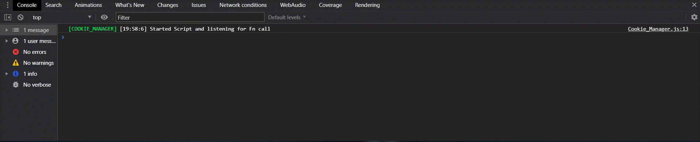

# Cookie manager v1.0


What is  cookie manager? Its a simple, lightweight JavaScript for handling cookies

## what can you do:

- Create cookies
- Remove cookies
- Grab info off cookies

### Cmd List
```
setCookie(name,value,days)
 
getCookie(name)

eraseCookie(name)
```

## Why is it use full to have a lightweight Cookie manager?

1) Faster to load a simple script rather than a bulky one 
2) Small in file size 
3) Great for low end spec pc's
4) who want to install like 50 scripts 'Not me'
## Usage

To start using Cookie manager go to your `index.html` and put in this line of code then put 

`cookies_manager.js` in the same folder as your index

````html
<script type="text/javascript" src="Cookie_Manager.js"></script>
````

This loads the script on to your site.

Great , now its loaded and you showuld see in your console when you refresh the page



Then you can now run the functions in cookie manager

## example

```
setCookie("age","15",365);
```
Note: you can do this in the console using chrome dev tools
this sets a cookie called age you can see your cookies by going into the application tab and click on cookies here you can manage your cookies


and as always cookie go mmmmmm :)
